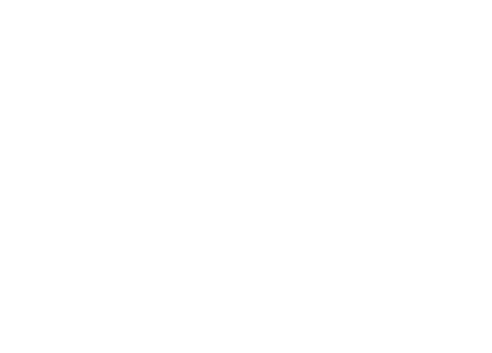

<a name="readme-top"></a>

[![Contributors][contributors-shield]][contributors-url]
[![Forks][forks-shield]][forks-url]
[![Stargazers][stars-shield]][stars-url]
[![Issues][issues-shield]][issues-url]
[![MIT License][license-shield]][license-url]

<!-- PROJECT LOGO -->
<br />
<div align="center">
  <a href="https://github.com/jauhar-imtikhan/asr">
    
  </a>

<h3 align="center">ASR Furniture</h3>

  <p align="center">
    Melayani Pemesanan Interior Meubel Dan Lain-Lain
    <br />
    <a href="https://github.com/jauhar-imtikhan/asr"><strong>Dokumentasi »</strong></a>
    <br />
    <br />
    <a href="https://github.com/jauhar-imtikhan/asr">Lihat Demo</a>
    ·
    <a href="https://github.com/jauhar-imtikhan/asr/issues">Laporkan Bug</a>
    ·
    <a href="https://github.com/jauhar-imtikhan/asr/issues">Request Fitur</a>
  </p>
</div>

<!-- TABLE OF CONTENTS -->
<details>
  <summary>Daftar Isi</summary>
  <ol>
    <li>
      <a href="#about-the-project">Tentang Project</a>
      <ul>
        <li><a href="#built-with">Di Buat Dengan</a></li>
      </ul>
    </li>
    <li>
      <a href="#getting-started">Mulai</a>
      <ul>
        <li><a href="#prerequisites">Yang Di Butuhkan</a></li>
        <li><a href="#installation">Instalasi</a></li>
      </ul>
    </li>
    <li><a href="#usage">Penggunaan</a></li>
    <li><a href="#fitur">Fitur</a></li>
    <li><a href="#contributing">Kontribusi</a></li>
    <li><a href="#license">License</a></li>
    <li><a href="#contact">Contact</a></li>
  
  </ol>
</details>

<!-- ABOUT THE PROJECT -->

## Tentang Project

[![Product Name Screen Shot][product-screenshot]](https://example.com)

Ini adalah project E-meubel developed by: `Jauhar Imtikhan`

<p align="right">(<a href="#readme-top">Kembali Keatas</a>)</p>

### Di Buat Dengan

- [](https://codeigniter.com/)
- [![Bootstrap][Bootstrap.com]][Bootstrap-url]
- [![JQuery][JQuery.com]][JQuery-url]
- [](https://nodejs.org/)

<p align="right">(<a href="#readme-top">Kembali Keatas</a>)</p>

<!-- GETTING STARTED -->

## Mulai

Ini adalah contoh bagaimana Anda dapat memberikan instruksi tentang cara menyiapkan proyek Anda secara lokal. Untuk mendapatkan salinan lokal yang berjalan, ikuti langkah-langkah contoh sederhana berikut ini.

1. Unduh atau salin repository proyek Anda ke komputer lokal Anda.

2. Pastikan bahwa perangkat lunak yang diperlukan terinstal di komputer Anda. Ini mungkin termasuk lingkungan pengembangan seperti Node.js, Ruby, atau PHP, serta perangkat lunak pendukung seperti manajer paket seperti NPM atau Yarn.

3. Buka terminal atau command prompt pada komputer Anda dan navigasi ke direktori proyek Anda.

4. Instal dependensi proyek dengan menjalankan perintah yang sesuai, seperti `npm install` atau `bower install`.

5. Setelah instalasi selesai, jalankan proyek dengan perintah `npm start`

Dengan mengikuti langkah-langkah ini, Anda dapat dengan mudah menyiapkan proyek Anda secara lokal untuk pengembangan atau pengujian. Pastikan untuk mengikuti instruksi khusus untuk proyek Anda jika ada yang berbeda dengan contoh umum ini.

### Yang di Butuhkan

- npm
  ```sh
  npm install npm@latest -g
  ```

### Installasi

1. Clone repositori Ini
   ```sh
   git clone https://github.com/jauhar-imtikhan/asr.git
   ```
2. Install Paket NPM
   ```sh
   npm install
   ```

<p align="right">(<a href="#readme-top">Kembali Keatas</a>)</p>

<!-- USAGE EXAMPLES -->

## Penggunaan

Aplikasi ini sudah terpublikasi jika anda ingin menggunakan aplikasi ini silahkan hubungi :

_Untuk Lebih Lengkapnya Silahkan Cek [Documentation](https://example.com)_

<p align="right">(<a href="#readme-top">Kembali Keatas</a>)</p>

<!-- ROADMAP -->

## Fitur

- [ ] Tambah Ke Keranjang
- [ ] Cek Ongkir
- [ ] Lacak Pesanan
- [ ] Pembayaran Digital

Lihat Masalah [open issues](https://github.com/jauhar-imtikhan/asr/issues)

<p align="right">(<a href="#readme-top">Kembali Keatas</a>)</p>

<!-- CONTRIBUTING -->

## Kontribusi

Kontribusi adalah yang membuat komunitas open source menjadi tempat yang luar biasa untuk belajar, menginspirasi, dan berkreasi. Setiap kontribusi yang Anda buat **sangat dihargai**.

Jika Anda memiliki saran yang akan membuat ini lebih baik, silakan fork repo dan buat permintaan Pull. Anda juga dapat membuka masalah dengan tag "peningkatan".
Jangan lupa beri proyek bintang! Terima kasih lagi!

1. Fork Project
2. Buat Branch Fitur Anda (`git checkout -b fitur/AmazingFeature`)
3. Commit Perubahan Anda (`git commit -m 'Add some AmazingFeature'`)
4. Push ke Cabang (`git push Origin feature/AmazingFeature`)
5. Buka Pull Request

<p align="right">(<a href="#readme-top">Kembali Keatas</a>)</p>

<!-- LICENSE -->

## License

Distributed under the MIT License. See `LICENSE.txt` for more information.

<p align="right">(<a href="#readme-top">Kembali Keatas</a>)</p>

<!-- CONTACT -->

## Contact

Jauhar Imtikhan - [@twitter_handle](https://twitter.com/twitter_handle) - jauhar.imtikhan@gmail.com

Project Link: [https://github.com/jauhar-imtikhan/asr](https://github.com/jauhar-imtikhan/asr)

<p align="right">(<a href="#readme-top">Kembali Keatas</a>)</p>

<!-- ACKNOWLEDGMENTS -->

<!-- MARKDOWN LINKS & IMAGES -->
<!-- https://www.markdownguide.org/basic-syntax/#reference-style-links -->

[contributors-shield]: https://img.shields.io/github/contributors/jauhar-imtikhan/asr.svg?style=for-the-badge
[contributors-url]: https://github.com/jauhar-imtikhan/asr/graphs/contributors
[forks-shield]: https://img.shields.io/github/forks/jauhar-imtikhan/asr.svg?style=for-the-badge
[forks-url]: https://github.com/jauhar-imtikhan/asr/network/members
[stars-shield]: https://img.shields.io/github/stars/jauhar-imtikhan/asr.svg?style=for-the-badge
[stars-url]: https://github.com/jauhar-imtikhan/asr/stargazers
[issues-shield]: https://img.shields.io/github/issues/jauhar-imtikhan/asr.svg?style=for-the-badge
[issues-url]: https://github.com/jauhar-imtikhan/asr/issues
[license-shield]: https://img.shields.io/github/license/jauhar-imtikhan/asr.svg?style=for-the-badge
[license-url]: https://github.com/jauhar-imtikhan/asr/blob/master/LICENSE.txt
[linkedin-shield]: https://img.shields.io/badge/-LinkedIn-black.svg?style=for-the-badge&logo=linkedin&colorB=555
[linkedin-url]: https://linkedin.com/in/linkedin_username
[product-screenshot]: assets/images/2.png
[Ci-url]: https://img.shields.io/badge/next.js-000000?style=for-the-badge&logo=nextdotjs&logoColor=white
[React.js]: https://img.shields.io/badge/React-20232A?style=for-the-badge&logo=react&logoColor=61DAFB
[React-url]: https://reactjs.org/
[Vue.js]: https://img.shields.io/badge/Vue.js-35495E?style=for-the-badge&logo=vuedotjs&logoColor=4FC08D
[Vue-url]: https://vuejs.org/
[Angular.io]: https://img.shields.io/badge/Angular-DD0031?style=for-the-badge&logo=angular&logoColor=white
[Angular-url]: https://angular.io/
[Svelte.dev]: https://img.shields.io/badge/Svelte-4A4A55?style=for-the-badge&logo=svelte&logoColor=FF3E00
[Svelte-url]: https://svelte.dev/
[Laravel.com]: https://img.shields.io/badge/Laravel-FF2D20?style=for-the-badge&logo=laravel&logoColor=white
[Laravel-url]: https://laravel.com
[Bootstrap.com]: https://img.shields.io/badge/Bootstrap-563D7C?style=for-the-badge&logo=bootstrap&logoColor=white
[Bootstrap-url]: https://getbootstrap.com
[JQuery.com]: https://img.shields.io/badge/jQuery-0769AD?style=for-the-badge&logo=jquery&logoColor=white
[JQuery-url]: https://jquery.com
